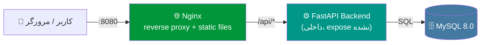
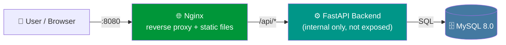

<div align="center">

# 🔥 Habit Tracker

**یک پروژه‌ی نمونه با معماری واقعی برای تمرین DevOps**
**A real-world-style sample project for practicing DevOps**

HTML/CSS &nbsp;•&nbsp; FastAPI &nbsp;•&nbsp; MySQL &nbsp;•&nbsp; Nginx &nbsp;•&nbsp; Docker Compose


[فارسی](#-فارسی) • [English](#-english)

</div>

---

## 🇮🇷 فارسی

### درباره‌ی پروژه

**Habit Tracker** یک اپلیکیشن ساده‌ی ردیابی عادت‌های روزانه است که عمداً کوچک نگه داشته شده تا تمرکز روی **معماری و اصول DevOps** باشد، نه پیچیدگی فرانت‌اند. هر عادتی که اضافه کنی، هر روز می‌تونی "انجام شد" بزنی و اپ به‌صورت خودکار **streak** (تعداد روزهای پشت‌سرهم انجام‌شدن) رو محاسبه می‌کنه.

پروژه از یک **معماری سه‌لایه‌ی واقعی** استفاده می‌کنه: فرانت‌اند استاتیک، بک‌اند API، و دیتابیس — همه داخل کانتینرهای مجزا، پشت یک ریورس‌پروکسی.

### ✨ ویژگی‌ها

- افزودن عادت جدید با انتخاب آیکون (ورزش، مطالعه، مدیتیشن، آب، خواب و ...)
- ثبت انجام‌شدن عادت در هر روز (یک بار در روز، با محدودیت `UNIQUE` در دیتابیس)
- محاسبه‌ی خودکار **streak** روزهای پشت‌سرهم
- حذف عادت
- رابط کاربری کاملاً **راست‌چین (RTL)** و فارسی
- بک‌اند بدون state، مناسب برای مقیاس‌پذیری افقی

### 🏗️ معماری



نکات کلیدی معماری:

- همه‌ی سرویس‌ها داخل یک شبکه‌ی داکری اختصاصی (`habit_net`) با هم صحبت می‌کنند.
- فقط **Nginx** روی پورت `8080` به بیرون expose شده؛ backend فقط با `expose` داخلی در دسترس بقیه‌ی سرویس‌هاست، نه هاست — دقیقاً الگوی امنیتی رایج در پروژه‌های واقعی.
- Nginx هم‌زمان نقش **serve فایل‌های استاتیک فرانت‌اند** و **ریورس‌پروکسی به `/api/`** را دارد.
- بک‌اند با `depends_on` + `healthcheck` منتظر آماده‌شدن کامل دیتابیس می‌ماند و علاوه بر آن، منطق retry داخلی (تا ۱۰ بار تلاش با فاصله‌ی ۲ ثانیه) برای اتصال به MySQL دارد.

### 📁 ساختار پروژه

```
habit-tracker/
├── frontend/                # HTML, CSS, JS خالص (بدون فریم‌ورک)
│   ├── index.html
│   ├── style.css
│   └── script.js
├── backend/
│   ├── app/
│   │   └── main.py          # منطق API + محاسبه‌ی streak
│   ├── requirements.txt
│   └── Dockerfile
├── nginx/
│   ├── nginx.conf           # کانفیگ reverse proxy
│   └── Dockerfile
├── mysql/
│   └── init.sql             # ساخت جدول‌ها + داده‌ی نمونه
├── docker-compose.yml
├── .env.example
└── .gitignore
```

### 🚀 اجرای پروژه

**پیش‌نیاز:** Docker و Docker Compose نصب باشند.

```bash
git clone <این-ریپو>
cd habit-tracker

# فایل env بساز و مقادیر واقعی رو جایگزین کن
cp .env.example .env

docker compose up --build
```

بعد از بالا آمدن کانتینرها، اپ روی آدرس زیر در دسترسه:

```
http://localhost:8080
```

> 💡 مستندات خودکار Swagger هم داخل کانتینر backend فعاله. اگه خواستی مستقیم و بدون عبور از nginx تستش کنی، موقتاً یک مپینگ پورت مثل `8000:8000` به سرویس `backend` در `docker-compose.yml` اضافه کن و به `http://localhost:8000/docs` برو.

### 🔑 متغیرهای محیطی (`.env`)

| متغیر | توضیح | مقدار نمونه |
|---|---|---|
| `MYSQL_ROOT_PASSWORD` | پسورد root دیتابیس MySQL | `change_me` |
| `MYSQL_DATABASE` | نام دیتابیس | `habit_tracker` |
| `MYSQL_USER` | یوزر اپلیکیشن برای اتصال به دیتابیس | `habit_user` |
| `MYSQL_PASSWORD` | پسورد همان یوزر | `change_me` |

⚠️ فایل `.env` در `.gitignore` قرار داره — هرگز پسورد واقعی رو کامیت نکن. فقط `.env.example` باید در ریپو بمونه.

### 📡 مستندات API

پیشوند تمام مسیرها: `/api`

| Method | مسیر | توضیح |
|---|---|---|
| `GET` | `/health` | health-check ساده برای مانیتورینگ |
| `GET` | `/habits` | لیست همه‌ی عادت‌ها به‌همراه streak و وضعیت امروز |
| `POST` | `/habits` | ساخت عادت جدید — بدنه: `{ "name": string, "icon": string }` |
| `POST` | `/habits/{id}/check` | ثبت انجام‌شدن عادت برای امروز |
| `DELETE` | `/habits/{id}` | حذف یک عادت |

**نمونه‌ی درخواست ساخت عادت:**

```bash
curl -X POST http://localhost:8080/api/habits \
  -H "Content-Type: application/json" \
  -d '{"name": "ورزش روزانه", "icon": "💪"}'
```

### 🗄️ مدل دیتابیس

```
habits                          habit_logs
┌────────────┬──────────┐      ┌──────────────┬──────────┐
│ id (PK)    │ INT      │◄─┐   │ id (PK)      │ INT      │
│ name       │ VARCHAR  │  │   │ habit_id (FK)│ INT      │
│ icon       │ VARCHAR  │  └───┤ log_date     │ DATE     │
│ created_at │ TIMESTAMP│      │              │          │
└────────────┴──────────┘      └──────────────┴──────────┘
                       UNIQUE(habit_id, log_date)
                       ON DELETE CASCADE
```

منطق **streak** در `backend/app/main.py` به این شکله: از امروز (یا دیروز، اگه امروز هنوز ثبت نشده) به عقب حرکت می‌کنه و تا زمانی که روزهای پشت‌سرهم در `habit_logs` وجود داشته باشن، شمارش ادامه پیدا می‌کنه.

### 🗺️ قدم بعدی‌ها برای بالابردن سطح DevOps

این پروژه عمداً ساده نگه داشته شده تا معماری واضح بمونه. برای تمرین بیشتر می‌تونی این‌ها رو اضافه کنی:

- [ ] **CI/CD** با GitHub Actions (build + lint + test خودکار روی هر push)
- [ ] **Multi-stage Docker build** برای کوچیک‌تر شدن image بک‌اند
- [ ] **HTTPS** با Let's Encrypt / certbot در nginx
- [ ] **Healthcheck** اختصاصی برای سرویس backend (نه فقط db)
- [ ] جدا کردن `docker-compose.prod.yml` برای دیپلوی روی VPS
- [ ] مانیتورینگ با **Prometheus + Grafana**
- [ ] لاگ متمرکز با **Loki** یا **ELK**
- [ ] تست‌های خودکار (unit test برای منطق streak، integration test برای API)


---

## 🇬🇧 English

### About

**Habit Tracker** is a deliberately small daily-habit tracking app, built to showcase a **real production-style architecture** rather than frontend complexity. Add a habit, mark it done each day, and the app automatically calculates your current **streak** (consecutive days completed).

It uses a genuine **three-tier architecture** — static frontend, API backend, and database — each in its own container, sitting behind a reverse proxy.

### ✨ Features

- Add new habits with an icon (exercise, reading, meditation, water, sleep, etc.)
- Mark a habit as done for the day (once per day, enforced by a `UNIQUE` DB constraint)
- Automatic **streak** calculation
- Delete a habit
- Fully **RTL** Persian UI
- Stateless backend, ready to scale horizontally

### 🏗️ Architecture



Key architectural decisions:

- All services communicate over a dedicated Docker network (`habit_net`).
- Only **Nginx** is exposed to the host, on port `8080`. The backend is only reachable by other containers via Docker's internal `expose`, not from the host — a common real-world security pattern.
- Nginx does double duty: it **serves the static frontend** and acts as a **reverse proxy for `/api/`**.
- The backend waits on the database via `depends_on` + a Compose `healthcheck`, and additionally has its own connection retry loop (up to 10 attempts, 2s apart) for extra resilience.

### 📁 Project Structure

```
habit-tracker/
├── frontend/                # Plain HTML, CSS, JS (no framework)
│   ├── index.html
│   ├── style.css
│   └── script.js
├── backend/
│   ├── app/
│   │   └── main.py          # API logic + streak calculation
│   ├── requirements.txt
│   └── Dockerfile
├── nginx/
│   ├── nginx.conf           # Reverse proxy config
│   └── Dockerfile
├── mysql/
│   └── init.sql             # Schema + seed data
├── docker-compose.yml
├── .env.example
└── .gitignore
```

### 🚀 Getting Started

**Prerequisites:** Docker and Docker Compose.

```bash
git clone <this-repo>
cd habit-tracker

# Create your env file and fill in real values
cp .env.example .env

docker compose up --build
```

Once the containers are up, the app is available at:

```
http://localhost:8080
```

> 💡 Swagger docs are available inside the backend container. To hit them directly (bypassing nginx), temporarily add a port mapping like `8000:8000` to the `backend` service in `docker-compose.yml`, then visit `http://localhost:8000/docs`.

### 🔑 Environment Variables (`.env`)

| Variable | Description | Example |
|---|---|---|
| `MYSQL_ROOT_PASSWORD` | MySQL root password | `change_me` |
| `MYSQL_DATABASE` | Database name | `habit_tracker` |
| `MYSQL_USER` | Application DB user | `habit_user` |
| `MYSQL_PASSWORD` | That user's password | `change_me` |

⚠️ `.env` is git-ignored — never commit real secrets. Only `.env.example` should live in the repo.

### 📡 API Reference

All routes are prefixed with `/api`.

| Method | Path | Description |
|---|---|---|
| `GET` | `/health` | Simple health check for monitoring |
| `GET` | `/habits` | List all habits with current streak & today's status |
| `POST` | `/habits` | Create a habit — body: `{ "name": string, "icon": string }` |
| `POST` | `/habits/{id}/check` | Mark a habit as done for today |
| `DELETE` | `/habits/{id}` | Delete a habit |

**Example — create a habit:**

```bash
curl -X POST http://localhost:8080/api/habits \
  -H "Content-Type: application/json" \
  -d '{"name": "Daily workout", "icon": "💪"}'
```

### 🗄️ Database Schema

```
habits                          habit_logs
┌────────────┬──────────┐      ┌──────────────┬──────────┐
│ id (PK)    │ INT      │◄─┐   │ id (PK)      │ INT      │
│ name       │ VARCHAR  │  │   │ habit_id (FK)│ INT      │
│ icon       │ VARCHAR  │  └───┤ log_date     │ DATE     │
│ created_at │ TIMESTAMP│      │              │          │
└────────────┴──────────┘      └──────────────┴──────────┘
                       UNIQUE(habit_id, log_date)
                       ON DELETE CASCADE
```

The **streak** logic in `backend/app/main.py` walks backward from today (or yesterday, if today isn't logged yet) and keeps counting as long as consecutive days exist in `habit_logs`.

### 🗺️ Roadmap / DevOps Next Steps

The project is kept intentionally simple so the architecture stays legible. Good next steps for going further:

- [ ] **CI/CD** with GitHub Actions (automated build + lint + test on every push)
- [ ] **Multi-stage Docker build** to shrink the backend image
- [ ] **HTTPS** via Let's Encrypt / certbot in nginx
- [ ] Dedicated **healthcheck** for the backend service (not just the DB)
- [ ] A separate `docker-compose.prod.yml` for VPS deployment
- [ ] Monitoring with **Prometheus + Grafana**
- [ ] Centralized logging with **Loki** or **ELK**
- [ ] Automated tests (unit tests for streak logic, integration tests for the API)